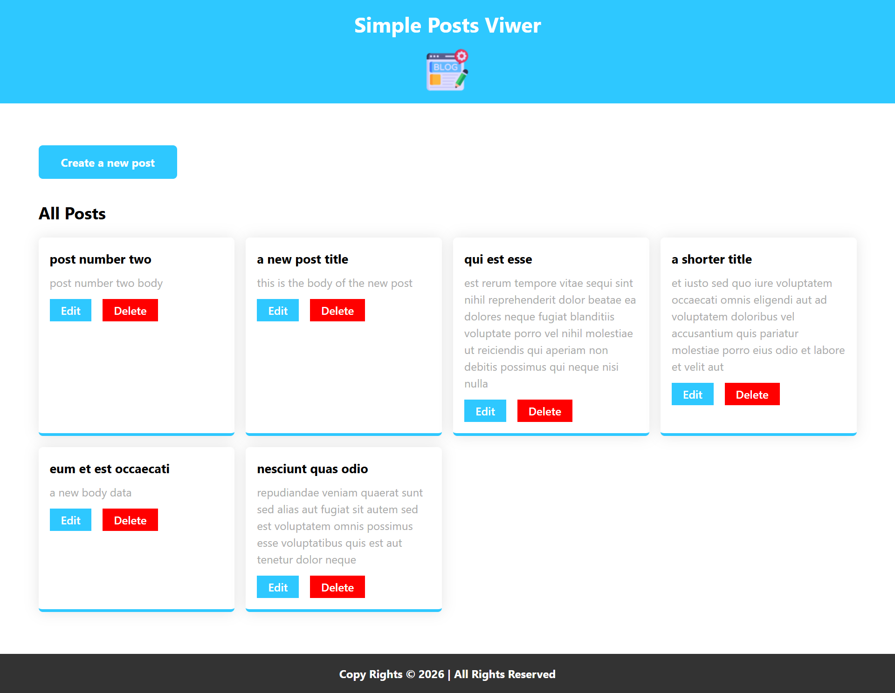

# Simple Posts Viewer

a simple front-end only CRUD operations using axios and jsonplaceholder APIs.

In this project, I've used React.js along with axios to make HTTP requests to GET/POST/PUT/DELETE posts data.

## 🚀 Live Demo

[Project Live Demo](https://my-posts-viewer.netlify.app/)

## 📸 Project Preview

## ✨ Features

- Display posts data from an API
- Make POST requests to create new posts
- Make PUT requests to update existing post's data
- Make DELETE request to delete an existing post
- Dynamic popups and smooth transitions
- Inputs checking and validation
- Loading state and good user experience

## 🛠️ Technologies Used

